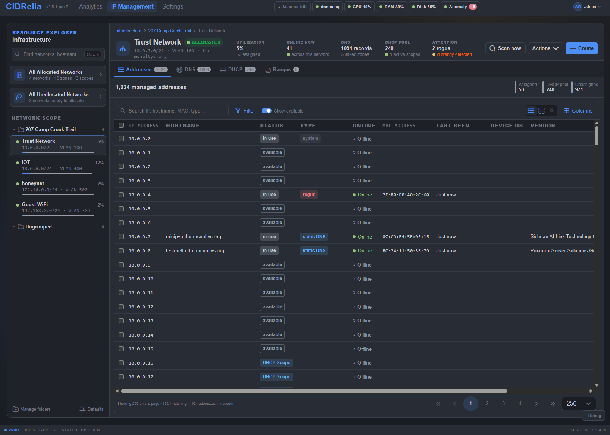
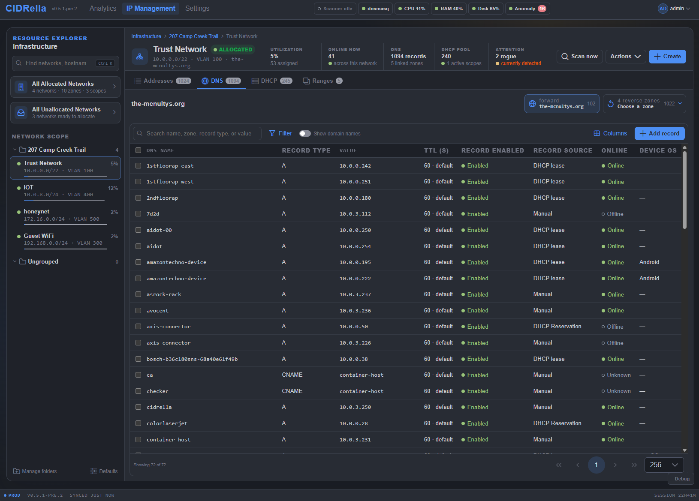
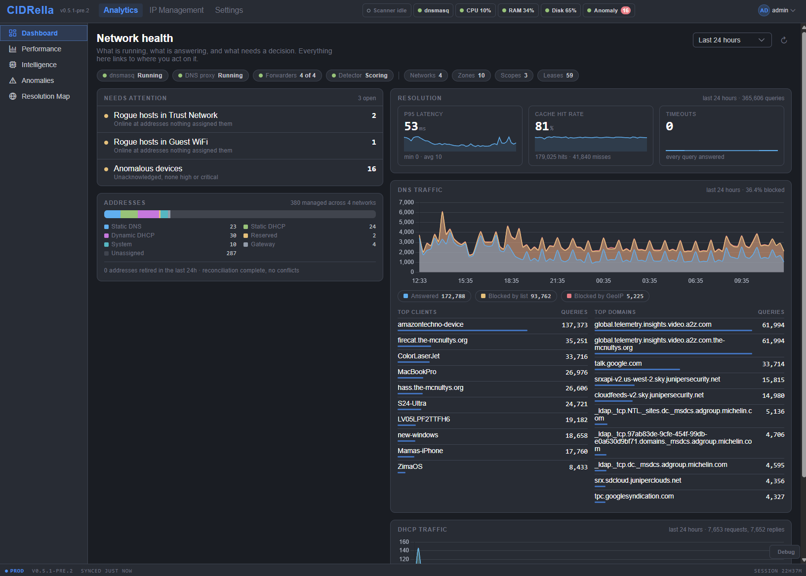
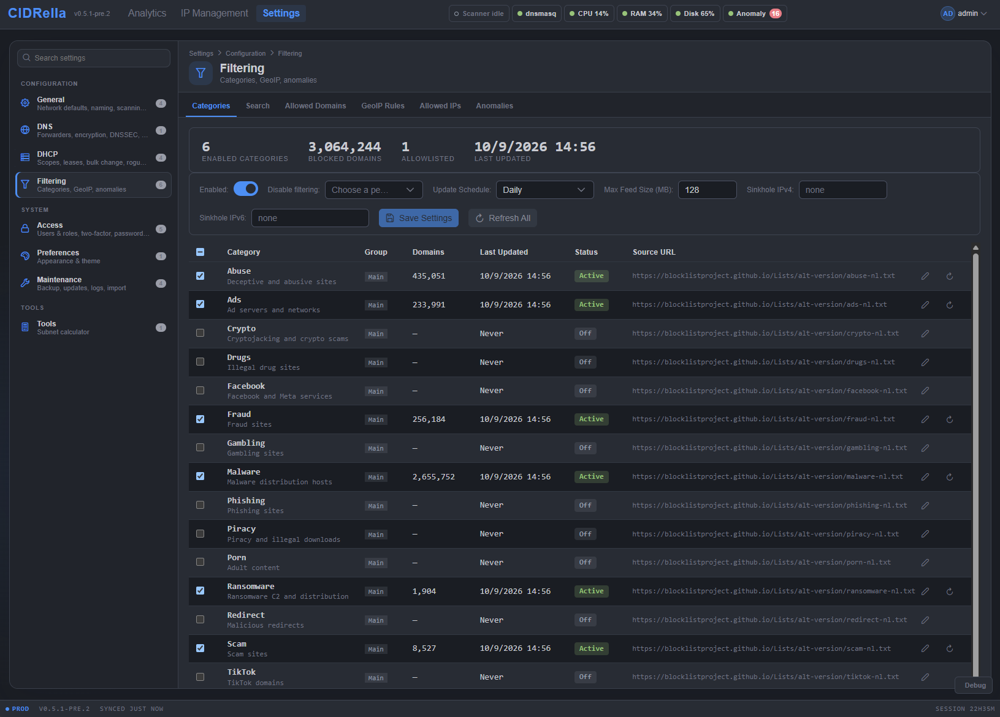
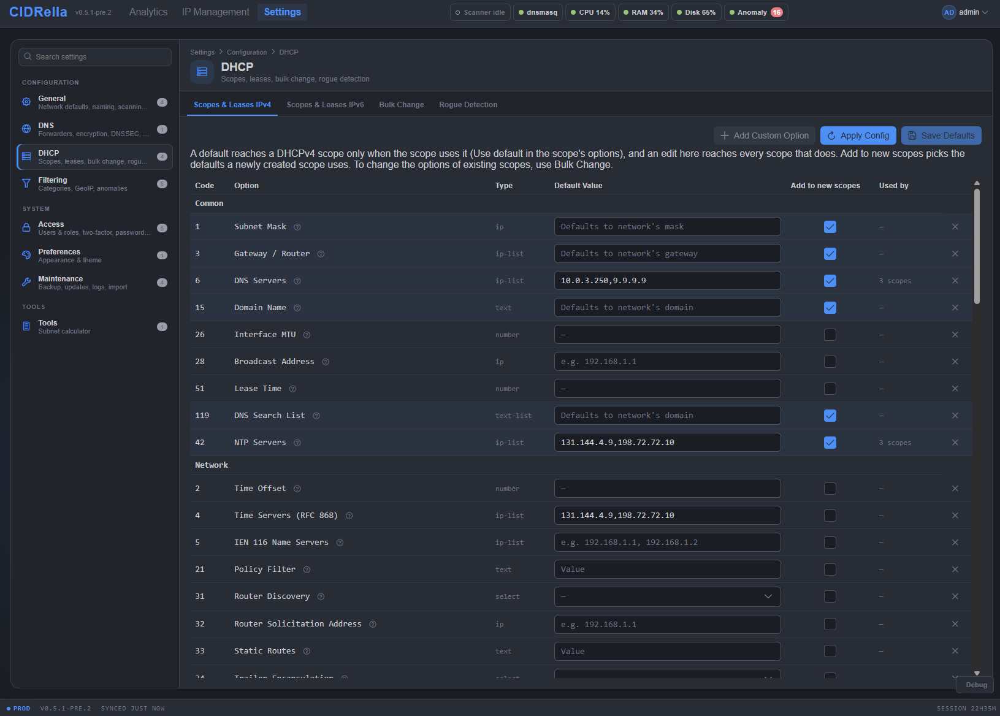

# CIDRella screenshots

Click any screenshot to open it, then use **Previous** and **Next** to step through them.

### [1. Addresses](ip-table.md)

Every address in a network in one table: status, type, online state, MAC, last seen, device OS and vendor. Rogue hosts are flagged where they sit, and the Columns menu adds and reorders columns.

### [2. Address grid](grid-view.md)

The same network as a grid, one cell per address, colored by what holds it: system, gateway, DHCP, static DNS, reserved, rogue or available. Ranges are outlined.

### [3. DNS records](dns-table.md)

The DNS tab for a network: records with their type, value, the TTL actually served, where each record came from (DHCP lease, reservation or manual) and whether the host is online.

### [4. DHCP](dhcp-table.md)

The DHCP tab: every address in the active scope with its reservation, lease state and expiry, beside the same status and online columns as the other tables.

### [5. Network health](dashboard.md)

The Analytics dashboard: what needs attention, how addresses are used, resolution latency and cache hit rate, DNS traffic with what was blocked, and the top clients and domains.

### [6. Resolver performance](performance.md)

How fast the resolver answers and what it costs: queries per minute, p95 latency, failed answers by cause, each upstream provider's answers and latency, and failovers.

### [7. Anomaly triage](anomalies.md)

One dot per monitored device, placed by how far it strays from its own baseline and how much its traffic is shaped like an attack. The queue ranks devices by score.

### [8. Filtering](filtering.md)

Blocklist categories with their sizes and refresh times, the update schedule, sinkhole addresses, and a control that pauses filtering for a chosen period.

### [9. DNS settings](dns-settings.md)

Upstream forwarders over plaintext, DoT or DoH with a backup used on failure or for load balancing, SOA defaults, and DNSSEC validation.

### [10. DHCP settings](dhcp-settings.md)

DHCP option defaults by code, which ones new scopes get, and how many scopes use each default.

[Back to the project README](../../README.md)
