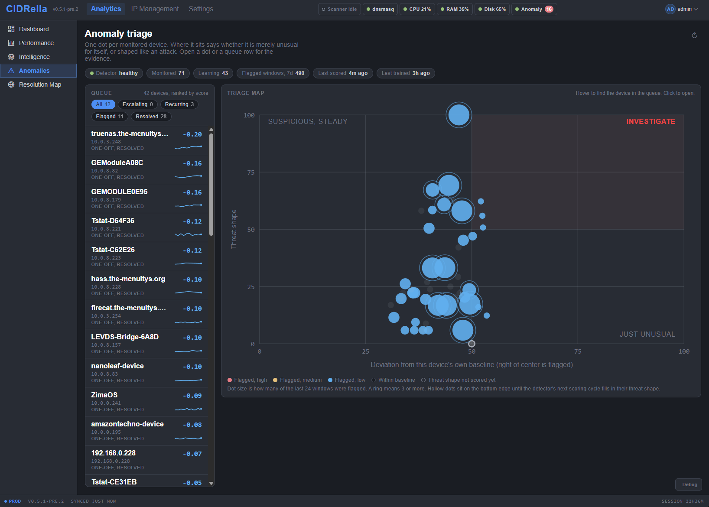

# Anomaly triage

[← Previous](performance.md) · [All screenshots](README.md) · [Next →](filtering.md) · 7 of 10

One dot per monitored device, placed by how far it strays from its own baseline and how much its traffic is shaped like an attack. The queue ranks devices by score.

[← Previous](performance.md) · [All screenshots](README.md) · [Next →](filtering.md) · 7 of 10
