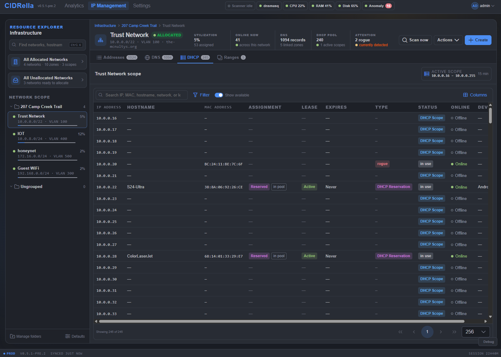

# DHCP

[← Previous](dns-table.md) · [All screenshots](README.md) · [Next →](dashboard.md) · 4 of 10

The DHCP tab: every address in the active scope with its reservation, lease state and expiry, beside the same status and online columns as the other tables.

[← Previous](dns-table.md) · [All screenshots](README.md) · [Next →](dashboard.md) · 4 of 10
