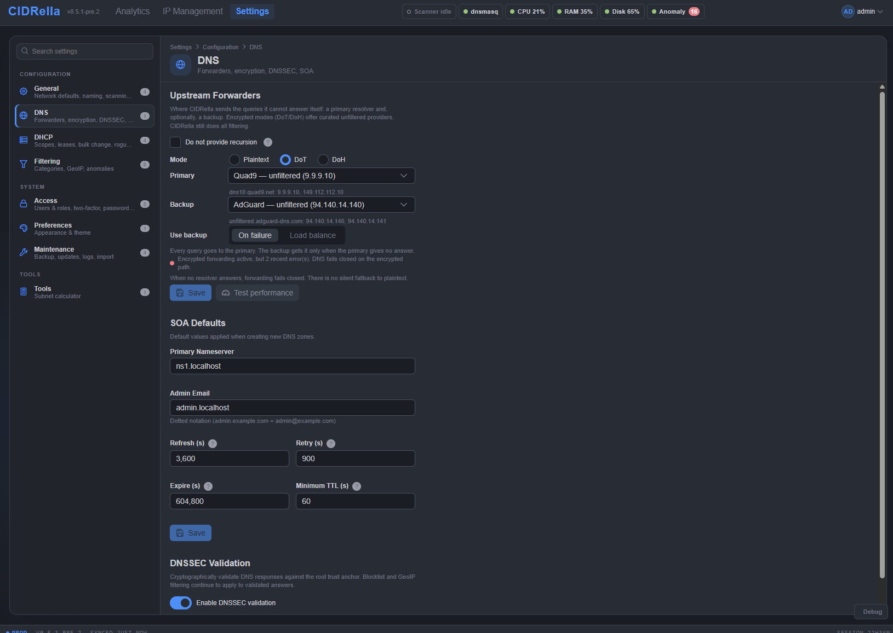

# DNS settings

[← Previous](filtering.md) · [All screenshots](README.md) · [Next →](dhcp-settings.md) · 9 of 10

Upstream forwarders over plaintext, DoT or DoH with a backup used on failure or for load balancing, SOA defaults, and DNSSEC validation.

[← Previous](filtering.md) · [All screenshots](README.md) · [Next →](dhcp-settings.md) · 9 of 10
