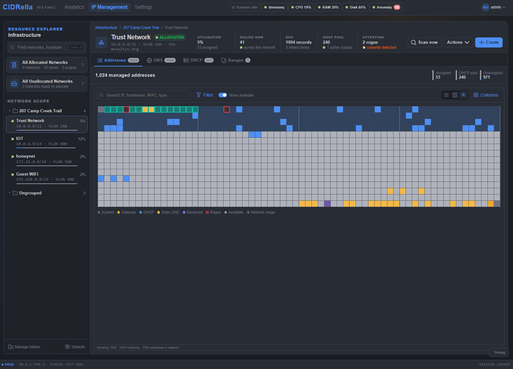

# Address grid

[← Previous](ip-table.md) · [All screenshots](README.md) · [Next →](dns-table.md) · 2 of 10

The same network as a grid, one cell per address, colored by what holds it: system, gateway, DHCP, static DNS, reserved, rogue or available. Ranges are outlined.

[← Previous](ip-table.md) · [All screenshots](README.md) · [Next →](dns-table.md) · 2 of 10
