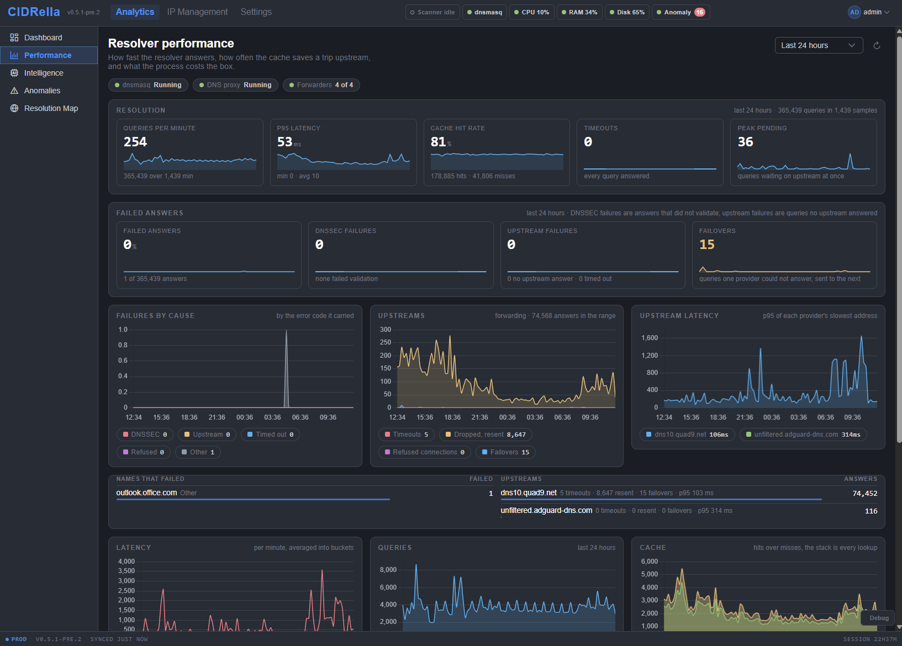

# Resolver performance

[← Previous](dashboard.md) · [All screenshots](README.md) · [Next →](anomalies.md) · 6 of 10

How fast the resolver answers and what it costs: queries per minute, p95 latency, failed answers by cause, each upstream provider's answers and latency, and failovers.

[← Previous](dashboard.md) · [All screenshots](README.md) · [Next →](anomalies.md) · 6 of 10
